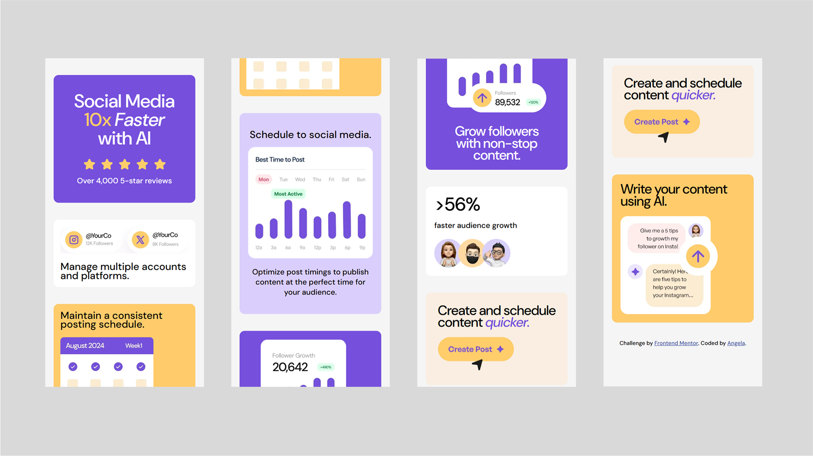

# Frontend Mentor - Bento Grid Solution

This is my solution to the [Bento grid challenge on Frontend Mentor](https://www.frontendmentor.io/challenges/bento-grid-RMydElrlOj). Frontend Mentor challenges help improve your HTML and CSS (and optionally JS/React) skills by building realistic UI components and layouts.

## Screenshot

### Desktop (1920px)

### Mobile (375px)

## Live Demo

- Live Site URL: [https://angela0405.github.io/FM-bento-grid/](https://angela0405.github.io/FM-bento-grid/)
- Solution Repo: [https://github.com/Angela0405/FM-bento-grid](https://github.com/Angela0405/FM-bento-grid)

## Built With

- Semantic HTML5
- CSS (mobile-first)
- CSS Grid & Flexbox
- Custom properties (CSS variables)
- Google Fonts - DM Sans

## What I Learned

This project helped me practice:

- Structuring a responsive grid layout using `display: grid`
- Combining grid and flexbox for more refined internal layout
- Using custom text classes like `.xl-text`, `.lg-text`, `.md-text`
- Organizing content blocks in a modular and scalable way
- How to follow a design system based on typography and spacing

## Continued Development

In the future, I’d like to keep improving:

- Responsive grid design using `minmax()` and `auto-fit`
- Adding animations or hover transitions for interactivity
- Accessibility: improving image `alt` text and semantic structure
- Code organization for larger UI systems

## Acknowledgments

Thanks to Frontend Mentor for another visually interesting and layout-focused challenge. It’s a great way to practice modern CSS techniques!
